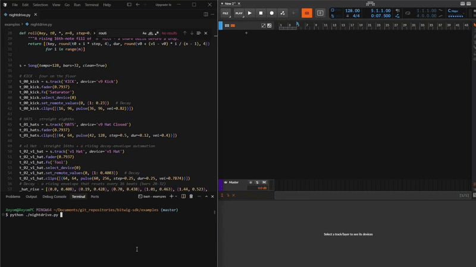

# openwig

**Algorithmic composition for Bitwig Studio. Write Python, get songs.**

[](LICENSE)
[](#compatibility)
[](#install)

Goes where Bitwig's official Controller API can't: build arrangements, devices,
automation, and full multi-track songs from a Python program, then
render to `.wav`.

Free and open source (GPL-3.0). Windows only. Early alpha.

**[Documentation →](https://axyom.github.io/openwig/)**



```python
from openwig import Song, Note

s = Song(tempo=128, bars=4, clean=True)

kick = s.track("KICK", device="v9 Kick")
kick.clip([Note(36, beat, dur=0.25) for beat in range(16)])

bass = s.track("BASS", device="FM-4")
bass.fx("Filter")
bass.clip([Note(33, beat+0.5, dur=0.4, vel=0.85) for beat in range(16)])

duck = []
for beat in range(16):
    duck += [(beat, 0), (beat + 0.99, 1)]
bass.automate("volume", duck)

hats = s.track("HATS", device="v9 Hat Closed")
hats.clip([Note(42, beat + 0.5, dur=0.2, vel=0.6) for beat in range(16)])

s.master(["EQ+", "Compressor+", "Peak Limiter"])
print(s.render("first.wav"))
```

## Compatibility

| openwig | Bitwig Studio | Python | OS |
|------------|---------------|--------|----|
| 0.1.x      | **6.0.6**     | 3.11+  | Windows |

## Install

```bash
pip install openwig
python -m openwig install   # copies the controller into Bitwig's user dir
```

Then in Bitwig: **Settings → Controllers → openwig → Add → OpenwigBridge** (one time), and run `python -m openwig doctor` (**required**: validates + caches the obfuscated symbols for your exact build; openwig refuses to run until it has, and you re-run it after a Bitwig update).

Full guide (requirements, troubleshooting, uninstall): **[Install docs →](https://axyom.github.io/openwig/install/)**

## Contributing

Issues and PRs welcome. Currently Windows + Bitwig 6, tested on Bitwig 6.0.6 only.

Found a bug or have a question? Open an [issue](https://github.com/Axyom/openwig/issues) for bugs, or start a thread in [Discussions](https://github.com/Axyom/openwig/discussions) for questions, ideas, and feedback.

## License

GPL-3.0-or-later. See [`LICENSE`](LICENSE).
